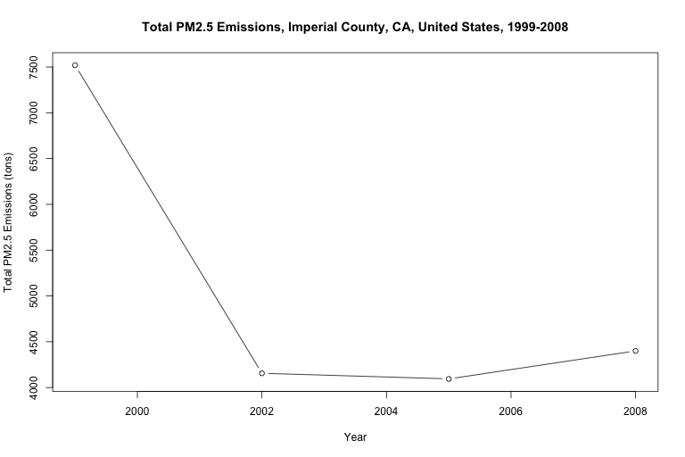

```{r setup, include=FALSE}
knitr::opts_chunk$set(echo = TRUE)
```

# Emissions-in-the-United-States-RProject#
Plotting pollutant emissions in the.United States using EPA's National Emissions Inventory Data (1999-2008)


##### Introduction #####

This work in progress plots fine particulate matter (PM2.5) emissions, and other pollutant emissions in the United States


##### Data Source #####

The data used for this project comes from the EPA's National Emissions Inventory, 1999-2008
The data used for this project can be found here:

*   [National Emissions Inventory Data]()


##### File Table #####

- "LOADDATA.R" Loads National Emissions Inventory data
- "PLOTALL.R" Runs all other scripts, generates all available plots  
- "USA_99-08_PM25Emissions.R" Generates an emissions plot for the United States
- "FIPS-XXX_99-08_PM25Emissions.R" Generates an emissions plot for the respective county


##### To Do #####

- replace data set with most extensive and updated data from EPA
- build plot code for other pollutants
- create data tags descriptions
- include most recent data
- 


##### Code

```{r pressure, echo=TRUE}
source("LOADDATA.R")
source("PLOTALL.R")
```

##### Plots #####

United States of America


North East United States


MidWest United States


South West United States





Southern United States


