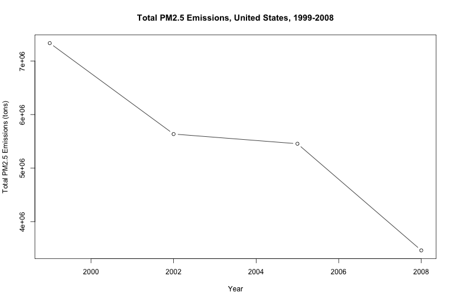
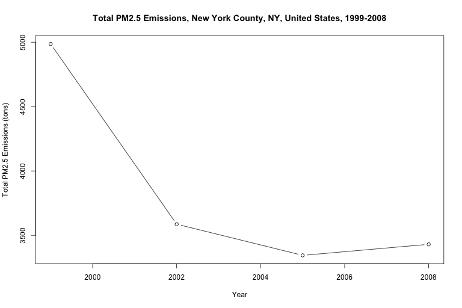
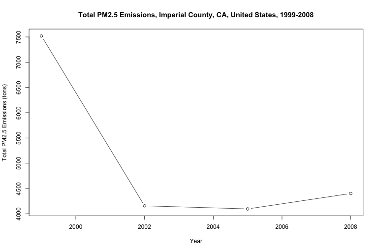
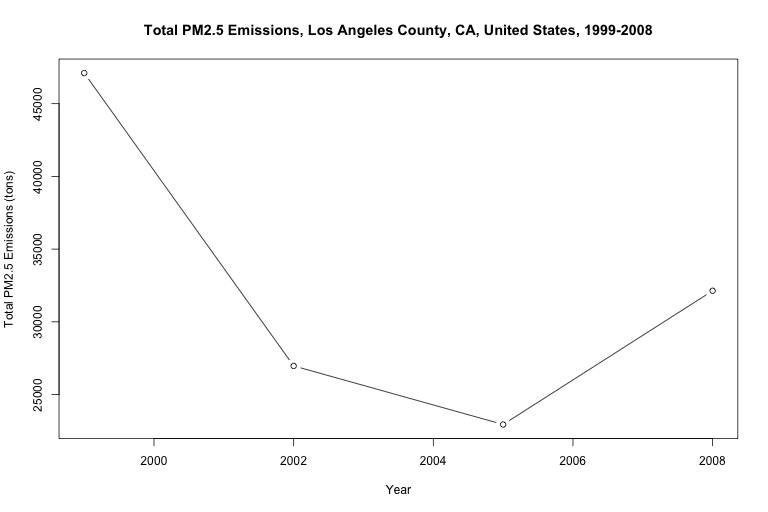
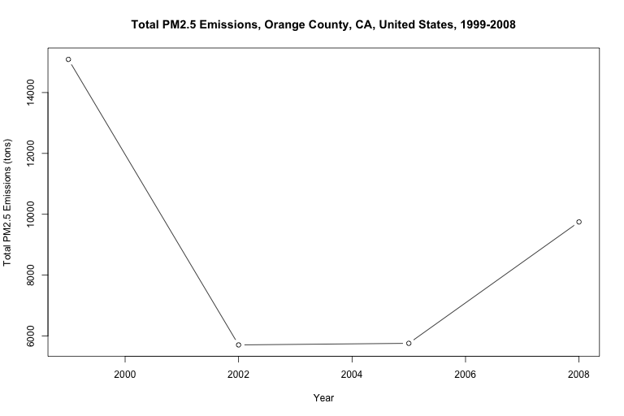
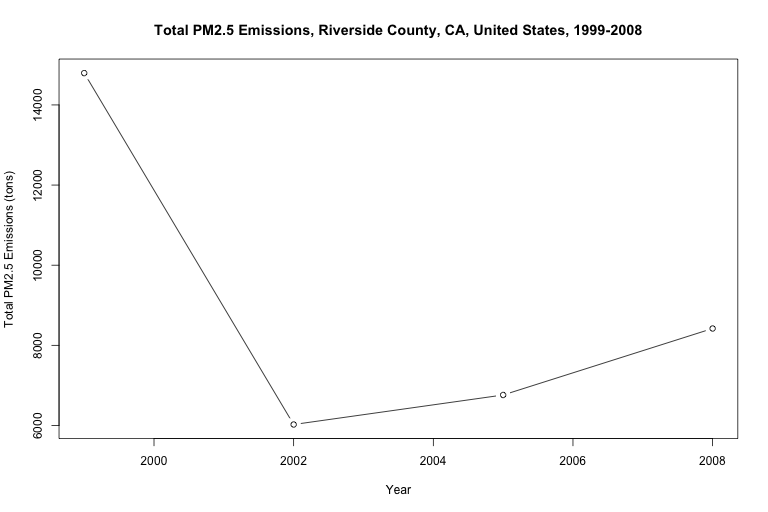
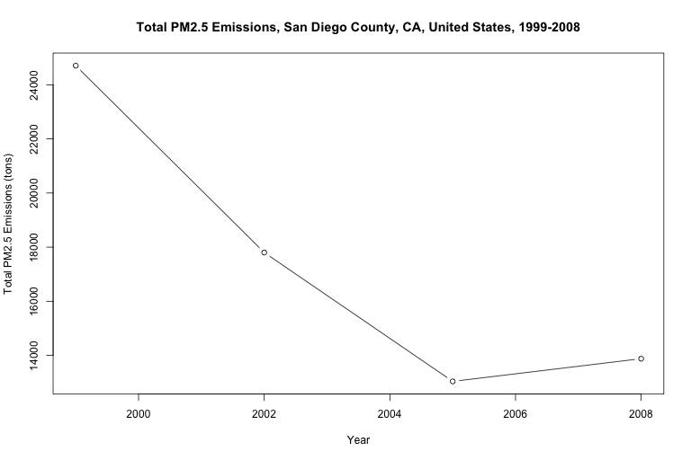
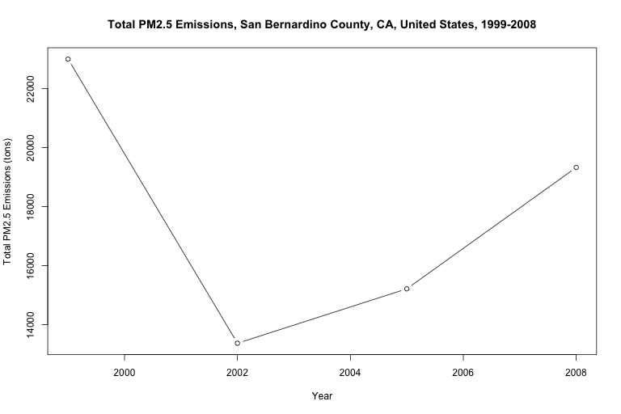

Regional Emissions in the United States \[Plotting National Emissions
Inventory\]
================
Ezequiel Contreras

# Emissions-in-the-United-States-RProject

Plotting pollutant emissions in the.United States using EPA’s National
Emissions Inventory Data (1999-2008)

##### Introduction

This work in progress plots fine particulate matter (PM2.5) emissions,
and other pollutant emissions in the United States

##### Data

The data used for this project comes from the EPA’s National Emissions
Inventory, 1999-2008

The data used for this project can be found here: \* [National Emissions
Inventory
Data, 1999-2000](https://github.com/ezequielc97/Emissions-in-the-United-States-RProject/tree/master/National_Emissions_Inventory_Data)

  - Alternatively, data can be downloaded here:
    [exdata\_data\_NEI\_data.zip](https://d396qusza40orc.cloudfront.net/exdata%2Fdata%2FNEI_data.zip)
    \[29Mb\]

Read more about the data here: \* \[EPA, National Emissions
Inventory\](<https://www.epa.gov/air-emissions-inventories/national-emissions-inventory-nei#>:\~:text=The%20National%20Emissions%20Inventory%20(NEI,pollutants%20from%20air%20emissions%20sources.)

##### File Table

  - “LOADDATA.R” Loads National Emissions Inventory data
  - “PLOTALL.R” Runs all other scripts, generates all available plots  
  - “USA\_99-08\_PM25Emissions.R” Generates an emissions plot for the
    United States
  - “FIPS-XXX\_99-08\_PM25Emissions.R” Generates an emissions plot for
    the respective county

##### To Do

  - replace data set with most extensive and updated data from EPA

  - build plot code for other pollutants

  - create data tags descriptions

  - include most recent data

  - 
##### Code

``` r
source("LOADDATA.R")
source("PLOTALL.R")
```

##### Plots

\#United States of America 

\#North East United States 



\#MidWest United States 

\#South West United States 













\#South United States 
