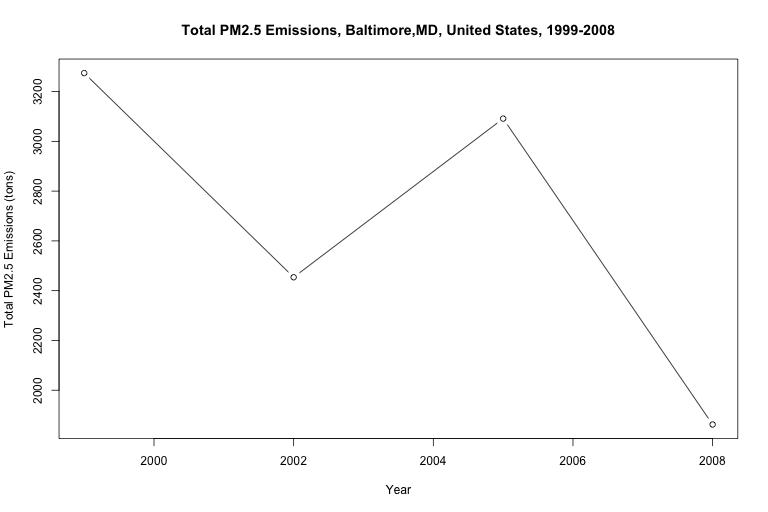

Regional Emissions in the United States \[Plotting National Emissions
Inventory\]
================
Ezequiel Contreras

# Emissions-in-the-United-States-RProject

Plotting pollutant emissions in the.United States using EPA’s

  - National Emissions Inventory Data (1999-2008)
  - National Emissions Inventory Data (2017)

##### Introduction

This work in progress plots fine particulate matter (PM2.5) emissions,
and other pollutant emissions in the United States. This project
currently includes data that comes from the EPA’s National Emissions
Inventory, 1999-2008 and 2017 (see end of doc)

##### File Table

  - “LOADDATA.R” Loads National Emissions Inventory data
  - “PLOTALL.R” Runs all other scripts, generates all available plots  
  - “USA\_99-08\_PM25Emissions.R” Generates an emissions plot for the
    United States
  - “FIPS-XXX\_99-08\_PM25Emissions.R” Generates an emissions plot for
    the respective county

<!-- end list -->

``` r
source("LOADDATA.R")
source("PLOTALL.R")
source("Region9_Scripts/NeighCountiesBarPlots/2017-CA-SjoseSfranOak-PM25.R")
source("Region9_Scripts/NeighCountiesBarPlots/2017-CA-SoCal-PM25.R")
```

##### To Do Next

  - replace data set with data accessible from EPA website
  - build county-level PM2.5 scripts
  - update filetable
  - tidy up directory
  - create pages for individual states, counties
  - plot emissions over time 1999-2017

##### Plots

##### United States of America over the Years

 \#\#\#\#\# San Jose–San
Francisco–Oakland, CA Combined Statistical Area in 2017 \#\#\#\#\#


##### Southern California Counties in 2017


##### North East United States




##### MidWest United States


##### South West United States


##### Southern United States


##### Data

This project currently includes data that comes from the EPA’s National
Emissions Inventory, 1999-2008 and 2017

The data used for this project can be found on this repo: \* [National
Emissions Inventory Data, 1999-2000 and 2017
(partialNEI)](https://github.com/ezequielc97/Emissions-in-the-United-States-RProject/tree/master/National_Emissions_Inventory_Data)

The full dataset can be accesses through the Environmental Protection
Agency’s website here: [National Emissions Inventory
Data](https://enviro.epa.gov/facts/nei/index.html)

Read more about the NEI data on the EPA’s website here:

  - [EPA, National Emissions
    Inventory](https://www.epa.gov/air-emissions-inventories/national-emissions-inventory-nei)

  - This project orignially used data provided by Coursera class
    “Exploratory Data Analysys” authorized by Johns Hopkins University
    (<https://www.coursera.org/learn/exploratory-data-analysis>). This
    set can be downloaded here:
    [exdata\_data\_NEI\_data.zip](https://d396qusza40orc.cloudfront.net/exdata%2Fdata%2FNEI_data.zip)
    \[29Mb\] (This data set is being replaced by data accessible through
    the EPA website)
